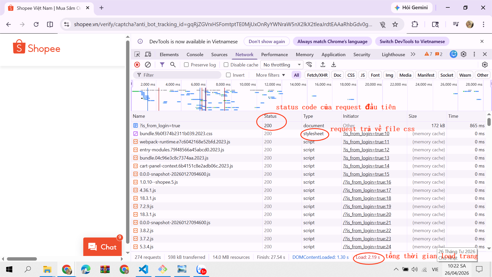

<<<<<<< HEAD
### PHẦN A
Câu A1:
1. Các bước xảy ra khi gõ https://shopee.vn vào trình duyệt và nhấn Enter
    - Bước 1: Request của mình xuất phát từ laptop -> đi qua router wifi nhà mình
    - Bước 2: Qua nhà mạng VNPT -> chạy xuyên cáp quang dưới đáy Thái Bình Dương
    - Bước 3: Đến data center của Shopee
    - Bước 4: Sever xử lý:"Tôi muốn xem trang chủ"
    - Bước 5: Reponse chạy ngược lại: cáp quang -> VNPT -> router -> laptop
    - Bước 6: Chrome nhận file HTML, CSS, JS -> render ra giao diện -> Mình thấy trang chủ 
* Nguồn tham chiếu: CCC_Frontend_2026/tuan_1_html5/01_introduction_html_universe.md - 🎬 Cuộc Hành Trình 0.3 Giây Xuyên Đại Dương

2. Tab network của shopee trả về:
    - Danh sách tất cả các request (HTML, CSS, JS, ảnh,...)
    - Status code (200-success, 204-no content, 302-redirection,...)
    - Thời gian load từng request
    - Tổng thời gian load trang
    - Loại tài nguyên (document, stylesheet, script,...)
* Ảnh minh họa: 

Câu A2:
1. Trang web sử dụng quá nhiều thẻ `
` không mang ý nghĩa khiến công cụ tìm kiếm như Google khó hiểu cấu trúc trang (header, menu, nội dung chính, footer,..) nên bị đánh giá SEO 
2. 4 lỗi semantic:
        + Sử dụng thẻ `
` thay vì thẻ semantic
        + Menu không dùng `<nav>`,...
        + Không có heading (`<h1>`, `<h2>`,...)
        + Không dùng `<section>`, `<main>`,... -> nội dung không được phân vùng rõ ràng
        + Thiếu thuộc  alt cho hình ảnh

**Code sửa lại**
<header>
    <h1 class="logo"><a href="/">ShopTLU</a></h1>
    <nav>
        <ul>
            <li><a href="/">Trang chủ</a></li>
            <li><a href="/products">Sản phẩm</a></li>
        </ul>
    </nav>
</header>

<main>
    <article class="product">
        <h2>iPhone 16 Pro</h2>
        
25.990.000đ

        <figure class="image">
            
        </figure>
    </article>
</main>

<footer>
    
© 2026 ShopTLU

</footer>

* Nguồn tham chiếu: CCC_Frontend_2026/tuan_1_html5/04_visible_part_html.md

Câu A3:
_________________________________
|            Hộp 1              | -> block chiếm cả dòng
_________________________________
Text A Text B                     -> nằm cạnh nhau, chung hàng
_________________________________
|            Hộp 2              | -> xuống dòng mới
_________________________________
Text C **Text D**                 -> nằm cạnh nhau, chung hàng
_________________________________
|            Hộp 3              | -> xuống dòng mới và chiếm cả dòng

* Giải thích chi tiết:
    - Dòng 1, 3, 5: Hiển thị dưới dạng một khối riêng biệt, chiếm toàn bộ chiều ngang của trình duyệt. Điều này là do thẻ `
` là phần tử block, nó luôn bắt đầu trên một dòng mới và chiếm hết chiều rộng khả dụng.
    - Dòng 2, 4: Hiển thị trên cùng một dòng. Điều này là do thẻ ``, `<strong>` đều là phần tử inline, không tạo dòng mới chỉ chiếm đúng phần nội dung nên chúng nằm cạnh nhau mà không xuống dòng.

* Nguồn tham chiếu: CCC_Frontend_2026/tuan_1_html5/04_visible_part_html.md - 📊 Block vs Inline — Hai loại element cơ bản

Câu A4:
* Sự khác nhau giữa các thẻ
    - `<thead>`: Phần đầu bảng, chứa tiêu đề các cột.
    - `<tbody>`: Phần thân bảng, chứa nội dung, dữ liệu chính của bảng.
    - `<tfoot>`: Phần chân bảng, dùng để tổng kết hoặc ghi chú.

* Lý do không dùng table để tạo layout trang web
    - Table chỉ dùng để hiển thị dữ liệu bảng (Tabular Data)
    - Bảng khó tùy chỉnh co giãn trên điện thoại
    - Cấu trúc lồng nhau (table > tr > td > table...) rắc rối, phức tạp và khó bảo trì

* Nguồn tham chiếu: CCC_Frontend_2026/tuan_1_html5/05_tables_hyperlinks.md - 📊 Table — Bảng dữ liệu